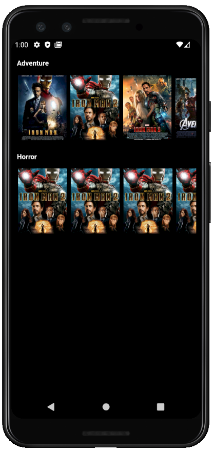
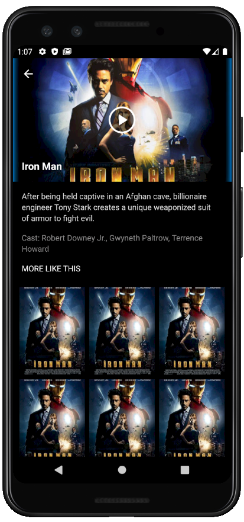

# NetflixRemake

### **Overview - About this project**
This is a clone of Netflit, the idea here is to create a App pretty similar to **Netflix** UI


### 📷 How is this App
</img>
</img>


### 💻Technology
- [Kotlin](https://kotlinlang.org/)
- [Material](https://material.io/)
- [Coil](https://coil-kt.github.io/coil/)
- [Retrofit](https://square.github.io/retrofit/)
- [GSON](https://github.com/google/gson)
- [Jarvis](https://github.com/gilsonjuniorpro/Jarvis)


### Libraries
```bash
    implementation 'com.google.android.material:material:1.1.0'
    implementation 'com.squareup.retrofit2:retrofit:2.7.2'
    implementation 'com.squareup.retrofit2:converter-gson:2.7.2'
    implementation 'com.github.gilsonjuniorpro:Jarvis:0.2.1'
    implementation("io.coil-kt:coil:0.9.1")
 ```
 
### Donation
If this project help you reduce time to develop, you can buy me a cup of coffee :) 

<a href="https://www.buymeacoffee.com/gilsonjuniorpro" target="_blank">
    
</a>
